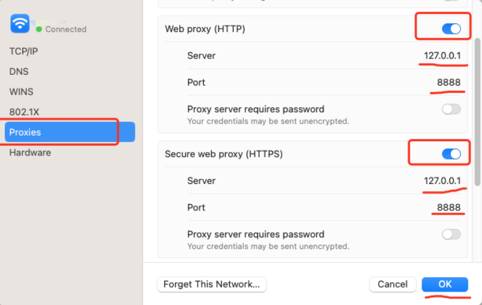

实现一个 https  的代理服务器
可以将所有的请求响应都输出到日志中

* 编译
make build

* 执行
  - ./https_proxy -addr=:8888 -log_file=/dev/stdout
  - 或者指定日志文件：./https_proxy -addr=:8888 -log_file=./log.txt

* 命令行测试：
  - curl --proxy "http://127.0.0.1:8888" "https://www.sogou.com/" -v -k
  - `-k`参数关闭本地证书校验

* macos 中配置代理：

